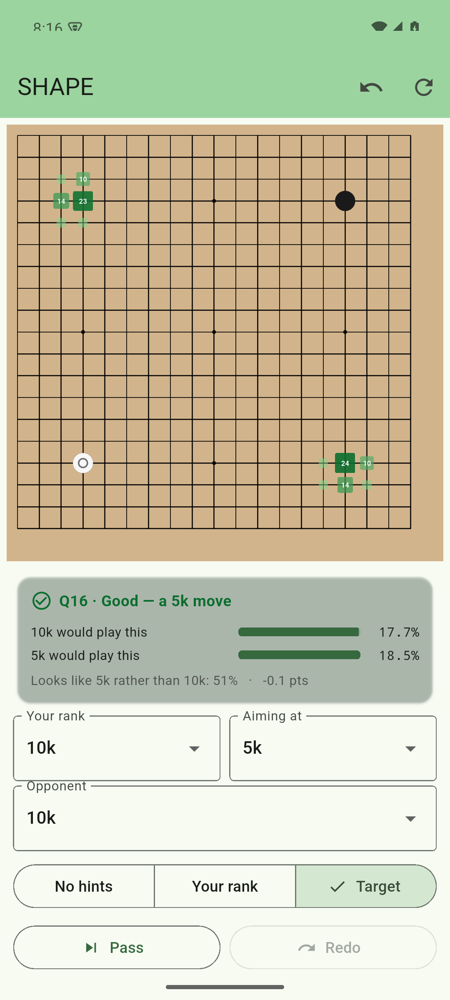

# SHAPE

SHAPE is a portrait-only Android app for practising Go against KataGo's
human-policy model. It compares each move with the policies for your current rank
and target rank. All inference runs on the phone.



The Flutter app lives in [`mobile/goshape`](mobile/goshape). Its README covers
the gameplay model, tests, local builds, release signing, and known limits.

The remaining Python under `tools/` exports the KataGo checkpoint, fixtures, and
MNN model used by the Android build. CI runs those exporters before it builds the
APK, so the model binary does not need to be committed.

## Check the app

```sh
cd mobile/goshape
flutter analyze
flutter test
```

The Android build supports arm64 devices running Android 8.0 or newer. It does
not support landscape orientation.
